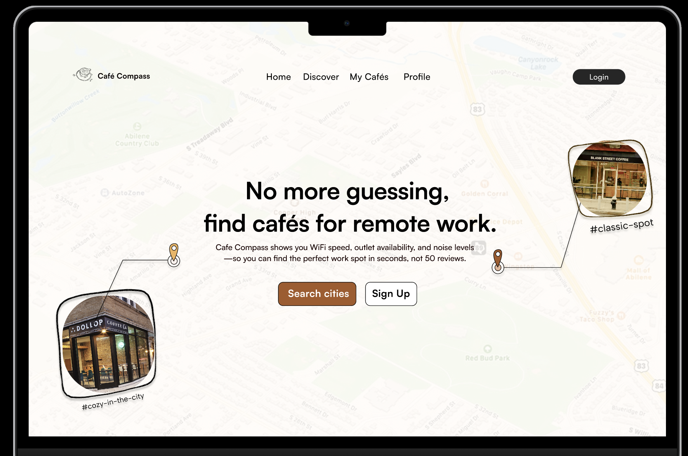

# ☕ CafeCompass

**Find the perfect cafe for remote work in seconds, not 50 reviews.**

CafeCompass helps cafe lovers and remote workers discover work-friendly cafes by analyzing 1000+ customer google reviews for you. WiFi speed, outlet availability, noise levels, and workspace quality are all scored using AI, so you can focus on what matters – getting work done in a cozy cafe atmosphere.



## ✨ Features

### 🗺️ **Interactive Map**
- Real-time cafe locations with color-coded work-friendliness scores
- Hover previews and detailed popup information
- Smooth map interactions with custom markers

### 🤖 **AI-Powered Analysis**
- Google Gemini AI analyzes customer reviews for work-related insights
- Automatic scoring for WiFi quality, noise levels, and workspace comfort
- Smart filtering of work-relevant reviews using keyword detection

### 👤 **User Features**
- Google OAuth authentication via Supabase
- Save favorite cafes to your personal collection
- View your cafe history and preferences

### 📊 **Rich Cafe Data**
- Opening hours with real-time open/closed status
- Google Maps integration for directions
- Photo galleries and detailed descriptions
- Work-specific amenities and ratings

## 🛠️ Tech Stack

### **Frontend**
- **React 18** with TypeScript
- **Vite** for fast development and building
- **Tailwind CSS** for styling
- **Framer Motion** for smooth animations
- **Mapbox GL JS** for interactive maps
- **React Router** for navigation

### **Backend**
- **Supabase** for database and authentication
- **Google Places API** for cafe data and photos
- **Outscraper API** for review scraping
- **Google Gemini AI** for review analysis
- **PostgreSQL** with Row Level Security

### **APIs & Services**
- Google OAuth 2.0 for authentication
- Google Places API for cafe information
- Mapbox for map rendering and geocoding
- Supabase for real-time database operations

## 🚀 Getting Started

### Prerequisites
- Node.js 18+ and npm
- Google Cloud Platform account
- Supabase account
- Mapbox account

### Installation

1. **Clone the repository**
   ```bash
   git clone https://github.com/yourusername/cafecompass.git
   cd cafecompass
   ```

2. **Install frontend dependencies**
   ```bash
   cd frontend
   npm install
   ```

3. **Install backend dependencies**
   ```bash
   cd ../backend
   npm install
   ```

4. **Set up environment variables**
   
   Create `frontend/.env.local`:
   ```env
   VITE_SUPABASE_URL=your_supabase_url
   VITE_SUPABASE_ANON_KEY=your_supabase_anon_key
   VITE_PUBLIC_MAPBOX_ACCESS_TOKEN=your_mapbox_token
   VITE_GOOGLE_CLIENT_ID=your_google_client_id
   ```

   Create `backend/.env.local`:
   ```env
   SUPABASE_URL=your_supabase_url
   SUPABASE_SERVICE_ROLE_KEY=your_supabase_service_key
   GOOGLE_PLACES_API_KEY=your_google_places_key
   OUTSCRAPER_API_KEY=your_outscraper_key
   GEMINI_API_KEY=your_gemini_api_key
   ```

5. **Set up the database**
   ```bash
   # Run the SQL schema in your Supabase dashboard
   psql -h your-supabase-host -f backend/user_schema.sql
   ```

6. **Start the development server**
   ```bash
   cd frontend
   npm run dev
   ```

## 📋 Database Schema

The application uses a PostgreSQL database with the following main tables:

- **`cafes`** - Core cafe information and work scores
- **`reviews`** - Filtered work-related customer reviews
- **`user_profiles`** - Extended user information
- **`user_favorites`** - User's favorited cafes
- **`user_notes`** - Personal cafe notes and ratings

## 🤖 AI Review Analysis

CafeCompass uses Google Gemini AI to analyze customer reviews and extract work-related insights:

### Work Score Calculation
- **WiFi Quality** (25%) - Connection speed and reliability
- **Noise Level** (25%) - Ambient noise and conversation volume
- **Workspace Comfort** (25%) - Seating, tables, and ergonomics
- **Outlet Availability** (25%) - Power access and charging options

### Review Processing Pipeline
1. **Keyword Filtering** - Identifies work-related reviews
2. **AI Analysis** - Extracts insights using structured prompts
3. **Score Aggregation** - Combines individual scores into overall rating
4. **Database Update** - Stores processed results

## 🗺️ Map Features

### Custom Markers
- **Green** (High Score 3.5+) - Excellent for work
- **Orange** (Medium Score 2.5-3.4) - Good with limitations
- **Red** (Low Score <2.5) - Not ideal for work

### Interactive Elements
- Hover previews with quick cafe info
- Click for detailed cafe popup
- Smooth zoom and pan animations
- Responsive design for all screen sizes

## 🔐 Authentication & Security

- **Google OAuth 2.0** integration via Supabase Auth
- **Row Level Security** policies for data isolation
- **Environment variables** for sensitive API keys
- **CORS configuration** for secure API access

## 🎨 Design System

CafeCompass uses a warm, coffee-inspired color palette:

- **Primary**: `#F0B35C` (Earth Yellow)
- **Secondary**: `#C87741` (Caramel)
- **Accent**: `#5A3E2B` (Café Noir)
- **Maps**: `#53714C` (Forest Green)

## 📱 Responsive Design

- **Mobile-first** approach with Tailwind CSS
- **Breakpoint system** for tablet and desktop
- **Touch-friendly** interactions for mobile devices
- **Progressive enhancement** for advanced features

## 🚀 Deployment

### Frontend (Vercel)
```bash
cd frontend
npm run build
vercel --prod
```

### Backend (Heroku/Railway)
```bash
cd backend
git add .
git commit -m "Deploy backend"
git push heroku main
```

### Database (Supabase)
- Database is automatically deployed via Supabase
- Run migrations through the Supabase dashboard
- Configure environment variables in hosting platform

## 📊 API Costs

Current API usage and costs per cafe:
- **Outscraper**: ~$0.10 per cafe (reviews + basic info)
- **Google Places**: ~$0.03 per cafe (photos + details)
- **Gemini AI**: ~$0.02 per cafe (review analysis)
- **Total**: ~$0.15 per cafe processed

## 🤝 Contributing

1. Fork the repository
2. Create a feature branch (`git checkout -b feature/amazing-feature`)
3. Commit your changes (`git commit -m 'Add amazing feature'`)
4. Push to the branch (`git push origin feature/amazing-feature`)
5. Open a Pull Request

## 📄 License

This project is licensed under the MIT License - see the LICENSE file for details.

## 🙏 Acknowledgments

- **Google Places API** for comprehensive cafe data
- **Supabase** for backend infrastructure and authentication
- **Mapbox** for beautiful map rendering
- **Outscraper** for review data collection
- **Google Gemini AI** for intelligent review analysis

---

**Built with ☕ for the remote work community**
